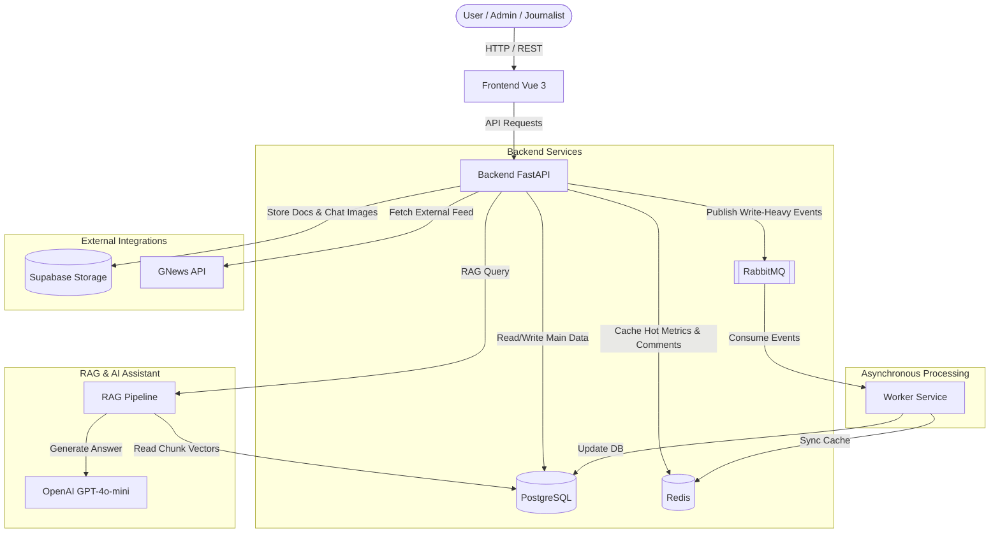

# NewsMatrix System Overview

This document provides a comprehensive overview of the architecture, technology stack, and core components of the **NewsMatrix** system - a smart news aggregator platform integrated with a multimodal RAG (Retrieval-Augmented Generation) assistant.

---

## 1. System Architecture

NewsMatrix is designed with a modern client-server architecture, completely decoupling the Frontend and Backend. It integrates asynchronous processing (Queue) and caching (Cache) mechanisms to achieve high performance.

---

## 2. Technology Stack

### 2.1. Frontend
- **Framework:** Vue 3 (Vite build tool).
- **State Management:** Pinia or Vue Reactivity API.
- **Routing:** Vue Router (with navigation guards for authorization check).
- **Styling:** Vanilla CSS and CSS Modules. Breathtaking Bento Box user interface, fully responsive for desktop and mobile devices.
- **Interactivity:** Axios client, dynamic image components.

### 2.2. Backend
- **Framework:** FastAPI (Python), utilizing asynchronous features (async/await) for high throughput.
- **Authentication:** JWT (JSON Web Tokens) with OAuth2 for Social Logins (Google & GitHub).
- **ORM:** SQLAlchemy with Alembic migrations for schema control.
- **Security:** Role-Based Access Control (RBAC) enforced via FastAPI dependency injection.

### 2.3. Caching & Message Queue
- **PostgreSQL:** Primary relational database. Integrates the **pgvector** extension to store and perform similarity search on RAG vector embeddings directly on PostgreSQL.
- **Redis:** In-memory caching for hot metrics (likes count, comments count, organization followers count), liked news lists, followed organizations, and comment feeds.
- **RabbitMQ:** Message queue to buffer write-heavy interactions (likes, unlikes, comments, follows, unfollows). Incoming events are queued and consumed asynchronously by a background Worker to protect PostgreSQL from spikes.

### 2.4. File Storage
- **Supabase Storage:** Object storage for uploaded PDF files (in the `raw_data` bucket) and chat images uploaded during conversations with the assistant (in the `chat-images` bucket).

---

## 3. Database Schema

The relational database consists of the following key tables:

1. **`roles`:** Enlists application roles (`Admin`, `Journalist`, `User`).
2. **`organizations`:** Stores news agencies, along with daily posting limits (`daily_post_limit`) and editing limits (`current_edit_limit`).
3. **`users`:** User accounts, email, hashed passwords, foreign keys to `role_id` and `organization_id` (if journalist).
4. **`news`:** Articles title, content, status (`Draft` or `Published`), view count, and publishing organization.
5. **`categories`:** Article categories. A news article can have multiple categories (resolved via the `news_categories` association table).
6. **`authors`:** Many-to-many relationship mapping multiple journalists (authors) to an article.
7. **`likes`, `comments`, `follows`:** Stores user interactions.
8. **`inbox`:** Internal mailbox messages between users.
9. **`documents`:** Tracks PDF documents uploaded by Admin (filename, total pages, chunk counts, Supabase path).
10. **`chunks`:** Document segments containing text content, vector embeddings (1536 dimensions matching OpenAI), and JSONB metadata storing raw text, tables, or image structures.

---

## 4. Caching and Asynchronous Details

When a user performs a write-heavy interaction like Liking an article:
1. The backend API handles the request and validates the user's JWT.
2. The API attempts to publish a JSON event payload to the `news_interactions` queue in RabbitMQ.
3. Simultaneously, the API updates the cached state in Redis (e.g., increments `like_count`, appends `news_id` to the user's list). The Frontend instantly reflects the change based on this cache update.
4. The background Worker (`api/worker.py`) consumes the event from RabbitMQ, updating PostgreSQL sequentially.
5. In case Redis or RabbitMQ are offline, the system falls back to direct synchronous database updates, ensuring service availability.
