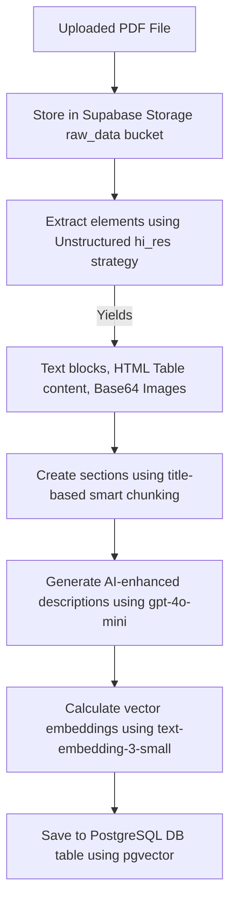
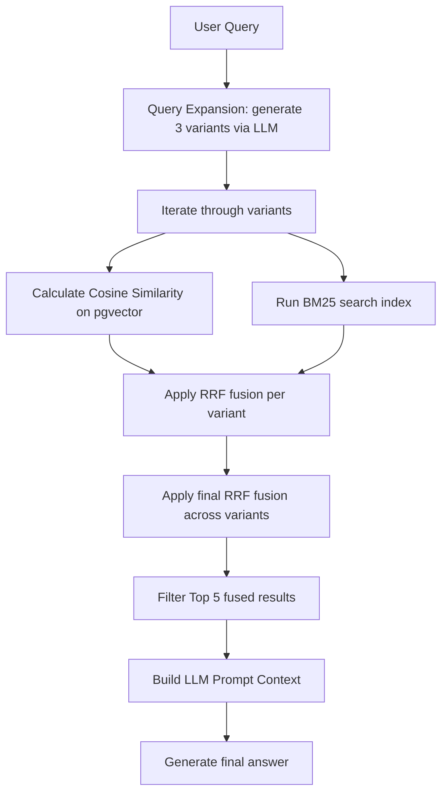

# RAG Architecture & Multimodal Assistant in NewsMatrix

This document outlines the technical design of the **RAG (Retrieval-Augmented Generation)** pipeline and the Multimodal Chat Assistant implemented in the **NewsMatrix** application.

---

## 1. RAG System Design Overview

The RAG implementation enables users to chat with an AI assistant to fetch information regarding system metrics, website configuration, or domain-knowledge documents uploaded by administrators.

A key highlight is the **Multimodal** capability: the assistant handles standard text queries, parses complex HTML table elements, and interprets visual media (charts, screenshots, and structural graphics) uploaded by the user or extracted from source documents.

---

## 2. Document Ingestion Pipeline

When an administrator uploads a PDF file through the Admin Portal, the ingestion pipeline (implemented in `api/services/document_ingestion.py` and `api/multi_model_chunk.py`) processes it as follows:

### Steps:
1. **High-Resolution Partitioning:**
   The `unstructured` library partitions the document. The `hi_res` strategy is used to extract structure, saving tables as HTML strings (`text_as_html`) and embedding figures/images as `base64` payloads.
2. **Title-Based Smart Chunking:**
   Rather than using a generic character count threshold, the pipeline runs `chunk_by_title`. This groups text by section headings, maintaining context.
   - Max chunk character limit: 3000.
   - Target chunk size: 2400.
   - Chunks below 500 characters are merged with neighbors to preserve contexts.
3. **AI-Enhanced Summarization:**
   For chunks containing images or tables, the text block, HTML table structures, and image context descriptions are sent to OpenAI `gpt-4o-mini`. The model generates a **searchable description** designed to maximize search findability for keywords and vector similarity.
4. **Vector Database Storage:**
   The enhanced summaries are embedded into 1536-dimensional vectors using `text-embedding-3-small` and saved in the `chunks` database table (enabling vector operations via PostgreSQL `pgvector`).

---

## 3. Query & Retrieval Pipeline

When a user chats with the assistant, the request goes through the `/assistant/chat` endpoint and triggers a retrieval flow:

### Optimization Techniques:
1. **Query Expansion (Multi-Query):**
   The user's query is expanded by generating 3 semantic variations using an LLM. This addresses short queries and uses alternate phrasing to cover a wider search range.
2. **Hybrid Search:**
   Each query variation queries the database using two distinct indexes:
   - **Vector Search:** Computes cosine similarity against the `embedding` column on PostgreSQL.
   - **BM25 Search:** Scores document terms based on keyword frequencies to match naming identifiers, codes, and abbreviations.
3. **Reciprocal Rank Fusion (RRF):**
   RRF merges candidate rankings from the Vector and BM25 searches. A second RRF pass combines the candidate sets of all query variations into a single list, ensuring the most relevant chunks rise to the top.

---

## 4. Multimodal Generation

Once the top 5 chunks are retrieved, the system constructs a context prompt for GPT-4o-mini:
- **Tables and Figures Integration:** Chunk metadata (`original_content`) is decoded. HTML tables are injected directly into the prompt text to represent columns/rows. Base64 media arrays are made available.
- **User Uploads:** If the user uploads a screenshot or chart in the chat panel, it is encoded as a base64 string and sent as an image block inside a multimodal OpenAI `HumanMessage`.
- **Media Tracking:** Images and HTML tables extracted from the retrieved documents are compiled and logged in a local file (`base64.txt`) for debugging.

This multimodal layout allows the assistant to explain financial tables, evaluate diagrams, and troubleshoot user screenshots.
